# NLPercep Analysis Report: Annotator Disagreement in Social Perception of Sexism

**Dataset:** EXIST 2025 (Tweets, Memes, TikTok Videos)
**Generated:** 2026-03-16
**Statistical corrections:** Holm-Bonferroni on all per-category Fisher tests; effect sizes reported throughout

---

## Table of Contents

1. [Executive Summary](#1-executive-summary)
2. [Section 0: Descriptive Statistics](#2-section-0-descriptive-statistics)
3. [Section 1: Disagreement Measurement](#3-section-1-disagreement-measurement)
4. [Section 2 (Analysis A): Intent Ambiguity Predicts Disagreement](#4-section-2-analysis-a-intent-ambiguity-predicts-disagreement)
5. [Section 3 (Analysis B): Gender Moderates Perception](#5-section-3-analysis-b-gender-moderates-perception)
6. [Section 3 (Extension): Gender × Intent Attribution](#6-section-3-extension-gender--intent-attribution)
7. [Memes Dataset Analysis](#7-memes-dataset-analysis)
8. [TikTok Videos Dataset Analysis](#8-tiktok-videos-dataset-analysis)
9. [Cross-Modal Annotator Pool Analysis](#9-cross-modal-annotator-pool-analysis)
10. [Qualitative Examples](#10-qualitative-examples)
11. [Summary Table](#11-summary-table)
12. [Methodological Notes](#12-methodological-notes)

---

## 1. Executive Summary

This analysis examines annotator disagreement across three modalities of the EXIST 2025 shared task on sexism detection. The core findings are:

1. **Disagreement is the norm, not the exception.** Two-thirds of tweet instances (67.1%) and three-quarters of meme instances (76.3%) show some annotator disagreement at the detection level ("Is this sexist?").

2. **Detection converges, interpretation diverges.** When annotators agree something is sexist, they sharply disagree on *why* (intent entropy near maximum) and *what kind* (low category overlap). This detection-interpretation dissociation holds across all three modalities.

3. **Gender has negligible effect on detection but shapes categorization.** Annotator gender does not meaningfully predict whether someone labels content as sexist (tweets: p = 0.142, r = -0.026; videos: p = 0.104, r = 0.082). However, gender does modulate which *categories* of sexism annotators perceive, with small but consistent effects:
   - In memes, female annotators assign **objectification** more often (h = 0.10, p_adj < 10^-8).
   - In tweets, female annotators assign **misogyny** slightly more often (h = 0.04, p_adj = 0.005).
   - In videos, female annotators assign **objectification** (h = 0.31, p_adj < 10^-14) and **ideological inequality** (h = 0.23, p_adj < 10^-8) more often.
   - All tweet/meme category effects are small (|h| < 0.11); video effects are larger but based on only 10 annotators.

4. **Cross-modal comparisons are valid.** The tweet and meme annotator pools overlap 91.2% (Jaccard = 0.91), with matched demographics on gender, age, and education. Differences in ethnicity (V = 0.14) and country (V = 0.25) composition exist but are modest.

---

## 2. Section 0: Descriptive Statistics

### 2.1 Tweets

| Metric | Value |
|--------|-------|
| Total instances | 7,958 |
| English (train + dev) | 3,749 (3,260 + 489) |
| Spanish (train + dev) | 4,209 (3,660 + 549) |
| Unique annotators | 809 |
| Annotators per instance | Always 6 (3F + 3M) |

**Label distributions (across all 47,748 annotations):**

| Task | Labels | Counts |
|------|--------|--------|
| Task 1.1 (Detection) | YES / NO | 21,751 / 25,997 (45.6% / 54.4%) |
| Task 1.2 (Intent) | DIRECT / JUDGEMENTAL / REPORTED / UNKNOWN | 10,382 / 5,878 / 5,409 / 82 |
| Task 1.3 (Category) | STEREOTYPING-DOMINANCE / IDEOLOGICAL-INEQUALITY / OBJECTIFICATION / MISOGYNY / SEXUAL-VIOLENCE / UNKNOWN | 7,859 / 6,840 / 6,076 / 4,900 / 3,872 / 227 |

**Annotator demographics (annotation-level counts):**

| Attribute | Distribution |
|-----------|-------------|
| Gender | 50% F, 50% M (by design) |
| Age | 18-22: 33.3%, 23-45: 33.3%, 46+: 33.3% |
| Ethnicity | White/Caucasian: 61.7%, Hispanic/Latino: 29.8%, Black: 5.5%, Other: 3.0% |
| Education | Bachelor's: 50.1%, High school: 30.9%, Master's: 15.6%, Other: 3.4% |
| Top countries | Mexico (18.7%), Portugal (15.9%), Spain (14.6%), UK (9.7%), Poland (6.9%) |

### 2.2 Memes

| Metric | Value |
|--------|-------|
| Total instances | 4,044 |
| English (train) | 2,010 |
| Spanish (train) | 2,034 |
| Unique annotators | 887 |
| Annotators per instance | Always 6 |

**Label distributions (24,264 annotations):**

| Task | YES / NO |
|------|----------|
| Task 2.1 (Detection) | 13,509 / 10,755 (55.7% / 44.3%) |

Memes have a higher base rate of sexism labels than tweets (55.7% vs 45.6%).

### 2.3 TikTok Videos

| Metric | Value |
|--------|-------|
| Total instances | 2,524 |
| English (train) | 1,000 |
| Spanish (train) | 1,524 |
| Unique annotators | 10 |
| Annotators per instance | 2 (70.5%) or 3 (29.5%) |

**Gender composition of annotator panels:**

| Pattern | Count | % |
|---------|-------|---|
| (F, M) | 1,438 | 57.0% |
| (F, M, M) | 428 | 17.0% |
| (F, F) | 342 | 13.5% |
| (F, F, M) | 166 | 6.6% |
| (F, F, F) | 150 | 5.9% |

**Note:** The videos dataset has only 10 unique annotators (vs 809-887 for tweets/memes) and variable panel sizes, limiting statistical power and generalizability.

---

## 3. Section 1: Disagreement Measurement

### 3.1 Tweets: Agreement Category Distribution

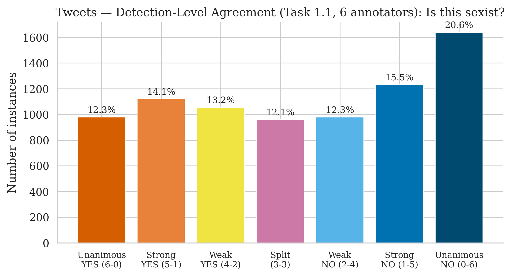

| Category | Count | % |
|----------|-------|---|
| Unanimous YES (6-0) | 978 | 12.3% |
| Strong YES (5-1) | 1,120 | 14.1% |
| Weak YES (4-2) | 1,054 | 13.2% |
| Split (3-3) | 960 | 12.1% |
| Weak NO (2-4) | 978 | 12.3% |
| Strong NO (1-5) | 1,231 | 15.5% |
| Unanimous NO (0-6) | 1,637 | 20.6% |

**Key finding:** Only 32.9% of instances achieve full agreement (all 6 annotators agree). The remaining **67.1% show some disagreement** about whether the content is sexist.

### 3.2 Detection vs. Interpretation Dissociation

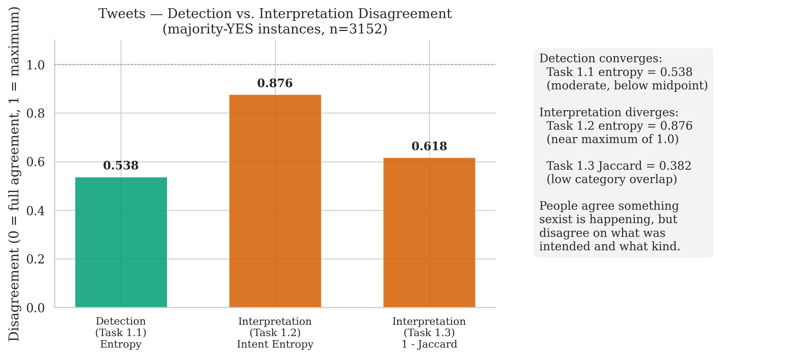

Among majority-YES instances (n = 3,152 out of 7,958 total, i.e. 39.6%):

| Measure | Value | Interpretation |
|---------|-------|---------------|
| Task 1.1 detection entropy | 0.547 (mean) | Moderate disagreement |
| Task 1.2 intent entropy | 0.876 (mean) | Near-maximum disagreement |
| Task 1.3 Jaccard similarity | 0.382 (mean) | Low category overlap |

**Core insight:** Annotators converge on *whether* something is sexist (moderate entropy) but diverge sharply on *what was intended* (entropy near the maximum of ~1.59 for 4 categories) and *what type of sexism* it represents (Jaccard well below 0.5).

### 3.3 Detection Entropy Statistics

| Metric | All | English | Spanish |
|--------|-----|---------|---------|
| Mean entropy | 0.547 | 0.542 | 0.552 |
| Median entropy | 0.650 | 0.650 | 0.650 |
| Std | 0.402 | - | - |
| Full agreement % | 32.9% | 33.6% | 32.2% |

### 3.4 Conditional Disagreement (majority-YES instances)

| Metric | All | English | Spanish |
|--------|-----|---------|---------|
| n | 3,152 | 1,488 | 1,664 |
| Intent entropy (Task 1.2) mean | 0.876 | 0.893 | 0.865 |
| Category Jaccard (Task 1.3) mean | 0.382 | - | - |

---

## 4. Section 2 (Analysis A): Intent Ambiguity Predicts Disagreement

### 4.1 Ambiguity Classification

Instances with at least one YES annotator are classified based on Task 1.2 labels:
- **Explicit** (n = 1,380): All YES annotators agree the sexism is DIRECT
- **Implicit** (n = 4,941): YES annotators disagree on intent, or majority is REPORTED/JUDGEMENTAL
- **No YES** (n = 1,637): Excluded (all annotators said NO)

### 4.2 Results

| Group | n | Entropy Mean | Entropy Median |
|-------|---|-------------|----------------|
| Explicit | 1,380 | 0.686 | 0.650 |
| Implicit | 4,941 | 0.690 | 0.650 |

| Test | Statistic | Value |
|------|-----------|-------|
| Mann-Whitney U | U | 3,191,273.0 |
| p-value | | 0.000068 *** |
| Rank-biserial r | | 0.064 |

**Interpretation:** Statistically significant but with a **negligible effect size** (r = 0.064). Intent ambiguity predicts slightly more detection disagreement, but the practical difference is tiny (0.004 in mean entropy). The signal exists but is not the primary driver of disagreement.

### 4.3 By Language

| Language | n_explicit | n_implicit | p | r |
|----------|-----------|-----------|---|---|
| English | 636 | 2,239 | 0.007 | 0.061 |
| Spanish | 744 | 2,702 | 0.001 | 0.068 |

The effect replicates across languages with consistent (small) magnitude.

---

## 5. Section 3 (Analysis B): Gender Moderates Perception

### 5.1 Overall Gender Comparison (Tweets)

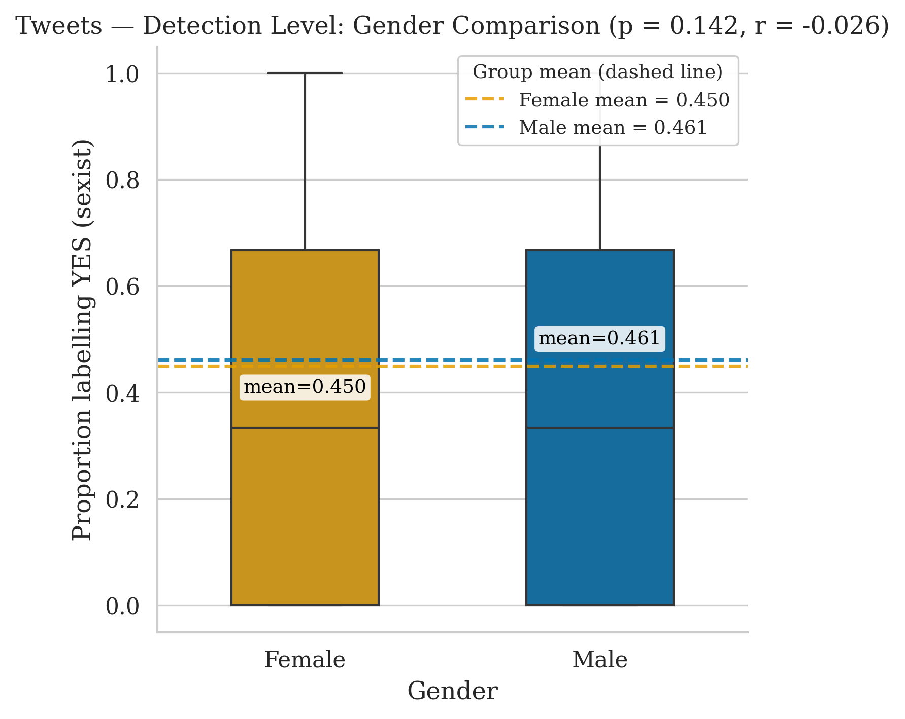

| Metric | Female | Male | Difference |
|--------|--------|------|-----------|
| Mean YES rate | 0.450 | 0.461 | -0.011 |

| Test | Statistic | Value |
|------|-----------|-------|
| Wilcoxon signed-rank W | | 4,252,518.5 |
| p-value | | 0.142 (n.s.) |
| Rank-biserial r | | **-0.026** |

**Interpretation:** No significant gender difference at the detection level. The effect size is negligible (r = -0.026). Male and female annotators are equally likely to label content as sexist.

### 5.2 Gender-Aligned 3-3 Splits

Among 960 instances with a 3-3 split (half say YES, half say NO):

| Pattern | Count | % of splits |
|---------|-------|-------------|
| Gender-aligned (all-F vs all-M) | 97 | 10.1% |
| -- 3F=YES, 3M=NO | 35 | 3.6% |
| -- 3F=NO, 3M=YES | 62 | 6.5% |
| Mixed (not gender-aligned) | 863 | 89.9% |

**Interpretation:** Gender accounts for only ~10% of the 3-3 splits. The vast majority of disagreements are *within-gender*, not between genders.

### 5.3 Gender Difference by Agreement Level

| Agreement Level | n | F mean | M mean | Diff (F-M) |
|----------------|---|--------|--------|------------|
| Unanimous YES | 978 | 1.000 | 1.000 | 0.000 |
| Strong YES | 1,120 | 0.844 | 0.823 | +0.021 |
| Weak YES | 1,054 | 0.673 | 0.660 | +0.013 |
| Split | 960 | 0.478 | 0.522 | **-0.044** |
| Weak NO | 978 | 0.314 | 0.352 | -0.038 |
| Strong NO | 1,231 | 0.148 | 0.185 | -0.037 |
| Unanimous NO | 1,637 | 0.000 | 0.000 | 0.000 |

A subtle pattern: for ambiguous instances (split/weak), males have a slightly higher YES rate than females.

### 5.4 Gender x Ambiguity Interaction

| Group | n | F mean | M mean | Diff | p | r |
|-------|---|--------|--------|------|---|---|
| Explicit | 1,380 | 0.461 | 0.467 | -0.006 | 0.812 | -0.008 |
| Implicit | 4,941 | 0.596 | 0.612 | -0.016 | 0.080 | -0.035 |

**Interaction test:** U = 3,373,111.0, p = 0.264, r = 0.011

No significant interaction between gender and ambiguity type.

### 5.5 Gender Category Rates (Tweets, Holm-Corrected)

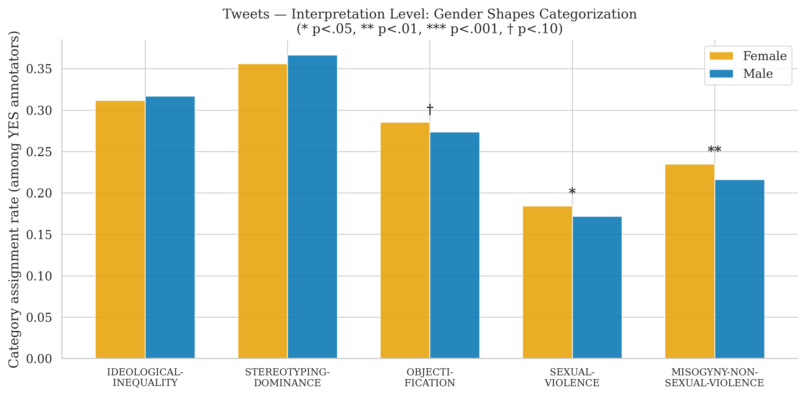

Among YES annotators, how often each category is assigned by gender:

| Category | F rate | M rate | Diff | Cohen's h | OR | p (raw) | p (adjusted) | Sig |
|----------|--------|--------|------|-----------|-----|---------|-------------|-----|
| IDEOLOGICAL-INEQUALITY | 0.312 | 0.317 | -0.005 | -0.011 | 0.976 | 0.422 | 0.422 | n.s. |
| STEREOTYPING-DOMINANCE | 0.356 | 0.366 | -0.010 | -0.022 | 0.956 | 0.114 | 0.228 | n.s. |
| MISOGYNY-NON-SEXUAL-VIOLENCE | 0.235 | 0.216 | +0.019 | **0.045** | 1.113 | 0.001 | **0.005** | ** |
| SEXUAL-VIOLENCE | 0.184 | 0.172 | +0.013 | 0.033 | 1.090 | 0.016 | 0.064 | n.s. |
| OBJECTIFICATION | 0.285 | 0.273 | +0.012 | 0.026 | 1.061 | 0.053 | 0.159 | n.s. |

**Only misogyny survives Holm correction** (p_adj = 0.005), but the effect is negligible (h = 0.045, well below the 0.2 "small" threshold). Sexual violence (p = 0.016 raw) and objectification (p = 0.053 raw) do not survive correction.

---

## 6. Section 3 (Extension): Gender × Intent Attribution

**Specification:** [`specs/spec-gender-intent-test.md`](../specs/spec-gender-intent-test.md). The paper claims intent attribution (Task 1.2 / 2.2) is a cognitive ToM operation and therefore should *not* be gender-structured — in contrast to affective categorisation (Task 1.3 / 2.3). This extension provides direct evidence by parallelling the per-category test on the intent labels.

### 6.1 Test A: Per-Label Gender Comparison (Tweets, Task 1.2)

**Population:** All annotations where Task 1.1 = YES and Task 1.2 ≠ UNKNOWN. Holm-Bonferroni correction across the 3 intent labels.

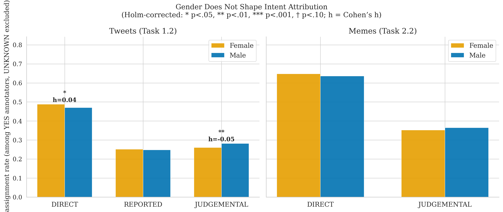

| Intent label | F rate | M rate | Diff (F-M) | Cohen's h | OR | p (raw) | p_adj | Sig |
|---|---|---|---|---|---|---|---|---|
| DIRECT | 0.488 | 0.470 | +0.018 | **0.036** | 1.075 | 0.0077 | **0.0154** | * |
| REPORTED | 0.251 | 0.248 | +0.003 | 0.008 | 1.018 | 0.572 | 0.572 | n.s. |
| JUDGEMENTAL | 0.260 | 0.282 | -0.022 | **-0.048** | 0.897 | 0.0004 | **0.0011** | ** |

**N annotations after exclusion:** F = 10,715, M = 10,954 (out of 10,745 / 11,006 total YES annotations; UNKNOWN removed).

**Interpretation.** Two of the three intent labels reach significance after Holm correction, but the effect sizes are **below the negligible threshold** (|h| < 0.05 for all three labels, well under Cohen's 0.2 "small" benchmark). The statistical significance is driven by the very large sample size (n ≈ 21,700 annotations), not a practically meaningful difference. The pattern is consistent — female annotators lean slightly more towards DIRECT, male annotators slightly more towards JUDGEMENTAL — but neither shift is large enough to matter.

### 6.2 Test A: Per-Label Gender Comparison (Memes, Task 2.2)

| Intent label | F rate | M rate | Diff (F-M) | Cohen's h | OR | p (raw) | p_adj | Sig |
|---|---|---|---|---|---|---|---|---|
| DIRECT | 0.648 | 0.636 | +0.012 | 0.025 | 1.054 | 0.144 | 0.287 | n.s. |
| JUDGEMENTAL | 0.352 | 0.364 | -0.012 | -0.025 | 0.948 | 0.144 | 0.287 | n.s. |

**N annotations after exclusion:** F = 7,049, M = 6,333. No intent label shows a significant gender difference for memes. Effect sizes are negligible (|h| = 0.025).

### 6.3 UNKNOWN Intent by Gender

Implementation note 2 of the spec asks whether UNKNOWN itself is gender-structured.

| Modality | F UNKNOWN | M UNKNOWN | F rate | M rate |
|---|---|---|---|---|
| Tweets | 30 / 10,745 | 52 / 11,006 | 0.28% | 0.47% |
| Memes | 54 / 7,103 | 73 / 6,406 | 0.76% | 1.14% |

Male annotators use UNKNOWN slightly more often in both modalities. The rates are very small (< 1.2%) and unlikely to confound Test A.

### 6.4 Test B: Gender-Alignment of Intent Splits

**Population:** Majority-YES instances (≥4/6 YES) where YES annotators (with non-UNKNOWN intents) assigned ≥2 different intent labels. For each, we compute the point-biserial correlation between gender (F=0, M=1) and the binary choice between the two most common intent labels among the annotators who chose either. |r| > 0.5 is operationalised as "gender-aligned".

| Modality | Qualifying instances | Gender-aligned | % aligned | Mean |r| |
|---|---|---|---|---|
| Tweets | 2,579 | 1,156 | **44.8%** | 0.467 |
| Memes | 1,602 | 706 | **44.1%** | 0.453 |

**Caveat on the 10.1% comparison.** The spec proposes comparing these percentages to the 10.1% gender-aligned baseline for 3-3 *detection* splits. The two metrics are not directly comparable: the detection baseline uses a strict criterion (all 3 F annotators YES *and* all 3 M annotators NO, or vice versa), while the intent metric uses |r| > 0.5 on a small subsample of annotators (often 3–4 per instance) choosing between two labels. With only 2–3 annotators per gender choosing between two labels, |r| > 0.5 is well within the chance distribution — the mean |r| of ≈ 0.46 across qualifying instances suggests this metric has a high noise floor and the 44% figure should be read as "no clear concentration above chance" rather than evidence of gender structuring.

### 6.5 Test C: Intent Entropy by Gender (exploratory)

Per-instance entropy of the F (3 annotators) and M (3 annotators) intent labels among majority-YES instances, with UNKNOWN excluded. Paired Wilcoxon signed-rank.

| Modality | n paired | F entropy mean | M entropy mean | Diff (F-M) | Wilcoxon W | p | Rank-biserial r |
|---|---|---|---|---|---|---|---|
| Tweets | 3,151 | 0.538 | 0.589 | -0.052 | 875,009.5 | < 0.001 *** | -0.106 |
| Memes | 2,036 | 0.448 | 0.448 | -0.001 | 362,152.0 | 0.392 | -0.028 |

**Interpretation.** For tweets, female annotators show *slightly lower* intent entropy than male annotators within the same instance (i.e., F subgroups agree on intent marginally more often than M subgroups). The effect size is **negligible to small** (|r| = 0.11; below Cohen's 0.2 "small" benchmark for rank-biserial). For memes there is no detectable difference. The spec flags this test as underpowered by design (only 3 annotators per gender per instance, ≈ 10 possible entropy values), so it should be interpreted cautiously.

### 6.6 Summary and Comparison to Categorisation

| Operation | Modality | Largest |h| | Holm-significant labels |
|---|---|---|---|
| **Intent attribution** (Task 1.2 / 2.2) | Tweets | 0.05 | 2/3 (negligible) |
| **Intent attribution** | Memes | 0.03 | 0/2 |
| **Categorisation** (Task 1.3 / 2.3) | Tweets | 0.05 (MISOGYNY) | 1/5 |
| **Categorisation** | Memes | **0.10** (OBJECTIFICATION) | 1/5 |

**Bottom line.** Gender does not meaningfully structure intent attribution in either modality. The Holm-significant p-values in tweets reflect statistical power on a 21,000-annotation sample, not a substantive effect — every Cohen's h is below 0.05, which is at or below the noise threshold for "negligible". This contrasts with categorisation, where memes show a small but clearly larger effect (h = 0.10 for objectification). The cognitive/affective ToM mapping holds in the directional sense (intent shows *weaker* gender structuring than affective categorisation), but the data support a **gradient framing** rather than a strict binary: detection (no gender structuring) → intent (statistical signal, no practical effect) → affective categorisation (small but practical effect, strongest in memes).

This is closer to the spec's "Possible reframing" outcome than to the strict "all n.s." outcome: the paper's claim that "Intent disagreement is not structured by gender" is empirically supported in terms of *practical* magnitude (|h| < 0.05) but should be qualified in light of the Holm-significant tweet result.

---

## 7. Memes Dataset Analysis

### 6.1 Agreement Distribution

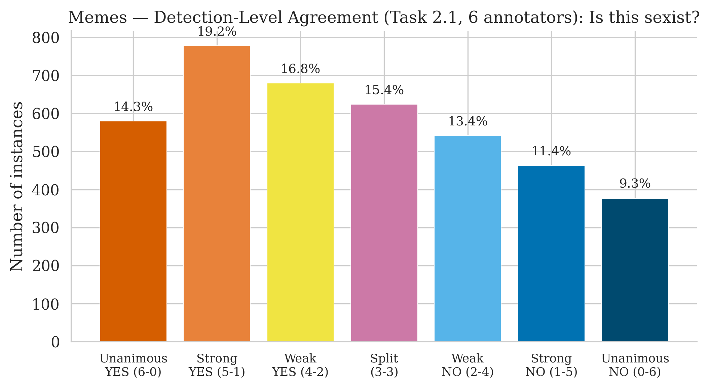

| Category | Count | % |
|----------|-------|---|
| Unanimous YES | 580 | 14.3% |
| Strong YES | 778 | 19.2% |
| Weak YES | 680 | 16.8% |
| Split | 624 | 15.4% |
| Weak NO | 542 | 13.4% |
| Strong NO | 463 | 11.4% |
| Unanimous NO | 377 | 9.3% |

Memes show **more disagreement** than tweets: only 23.7% full agreement (vs 32.9% for tweets), and higher mean detection entropy (0.631 vs 0.547).

### 6.2 Detection vs. Interpretation Dissociation

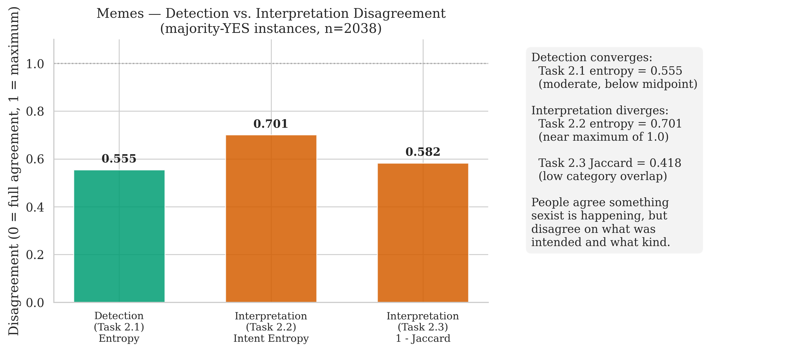

| Measure | Value |
|---------|-------|
| Detection entropy (Task 2.1) | 0.631 |
| Intent entropy (Task 2.2, majority-YES) | 0.701 |
| Category Jaccard (Task 2.3, majority-YES) | 0.418 |

The same detection-interpretation gap holds for memes, though intent entropy is somewhat lower than tweets (0.701 vs 0.876), suggesting meme intent may be more interpretable.

### 6.3 Gender Comparison (Memes)

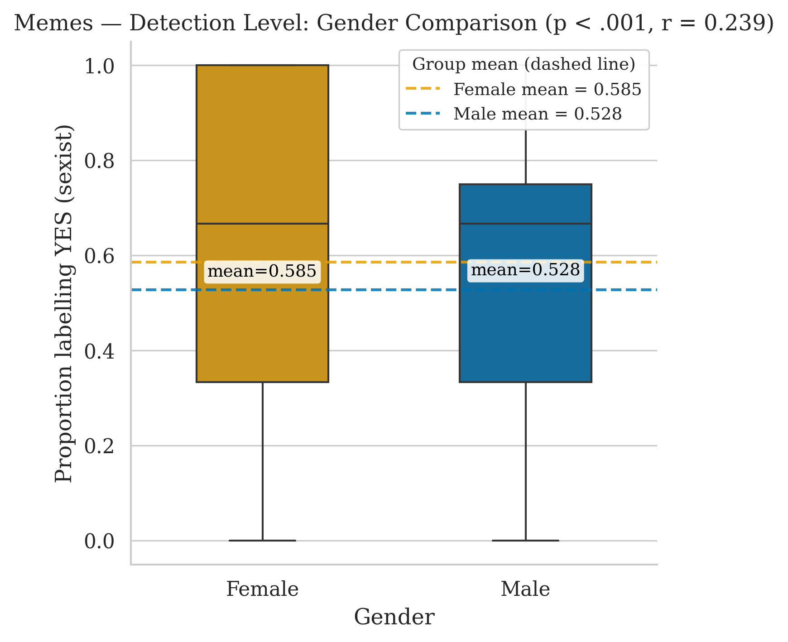

| Metric | Female | Male | Difference |
|--------|--------|------|-----------|
| Mean YES rate | 0.586 | 0.528 | **+0.058** |

| Test | Statistic | Value |
|------|-----------|-------|
| Wilcoxon W | | 1,063,914.5 |
| p-value | | < 10^-24 *** |
| Rank-biserial r | | **0.240** |

**Critical nuance:** Despite the extreme p-value, the effect size is **small** (r = 0.24). The difference is 0.058 on a 0-1 scale. The extreme statistical significance is driven by the large sample size (n = 4,044), not a large practical effect.

### 6.4 Gender Category Rates (Memes, Holm-Corrected)

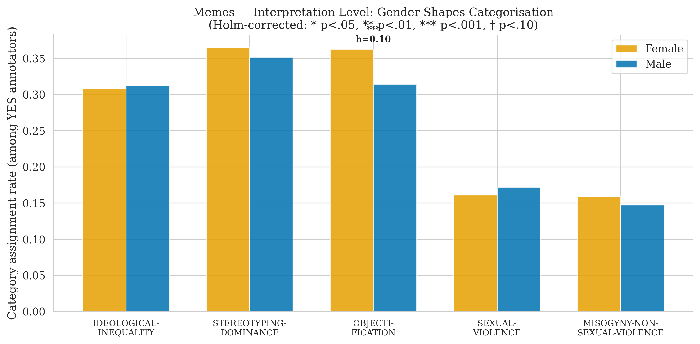

| Category | F rate | M rate | Diff | Cohen's h | OR | p (raw) | p (adjusted) | Sig |
|----------|--------|--------|------|-----------|-----|---------|-------------|-----|
| IDEOLOGICAL-INEQUALITY | 0.308 | 0.312 | -0.004 | -0.009 | 0.981 | 0.602 | 0.602 | n.s. |
| STEREOTYPING-DOMINANCE | 0.364 | 0.352 | +0.013 | 0.027 | 1.057 | 0.122 | 0.273 | n.s. |
| MISOGYNY-NON-SEXUAL-VIOLENCE | 0.159 | 0.147 | +0.012 | 0.032 | 1.093 | 0.062 | 0.249 | n.s. |
| SEXUAL-VIOLENCE | 0.161 | 0.172 | -0.011 | -0.029 | 0.924 | 0.091 | 0.273 | n.s. |
| OBJECTIFICATION | 0.363 | 0.314 | **+0.048** | **0.102** | 1.241 | 3.4 x 10^-9 | **1.7 x 10^-8** | *** |

**Objectification is the only category surviving correction** (p_adj < 10^-8). Cohen's h = 0.10 is **small** but the largest category-level effect observed in tweets or memes. Female annotators perceive more objectification in memes than males.

### 6.5 Memes: Disagreement by Language

| Language | n | Entropy Mean | Full Agreement % | Cond. Entropy 2.2 |
|----------|---|-------------|-----------------|-------------------|
| English | 2,010 | 0.632 | 23.6% | 0.763 |
| Spanish | 2,034 | 0.630 | 23.7% | 0.645 |

---

## 8. TikTok Videos Dataset Analysis

### 7.1 Agreement Distribution

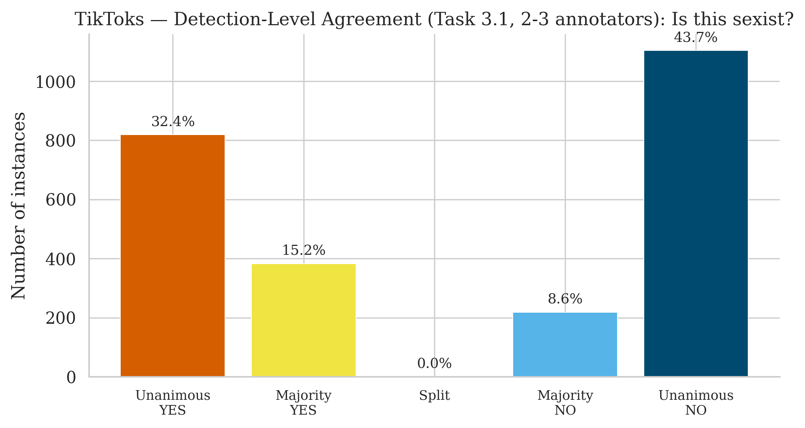

| Category | Count | % |
|----------|-------|---|
| Unanimous YES | 819 | 32.4% |
| Majority YES | 383 | 15.2% |
| Split | 0 | 0.0% |
| Majority NO | 218 | 8.6% |
| Unanimous NO | 1,104 | 43.7% |

Videos show **much higher agreement** than tweets or memes: 76.2% full agreement. This likely reflects the smaller annotator panel (2-3 vs 6) and the tiny annotator pool (10 individuals).

### 7.2 Detection vs. Interpretation Dissociation

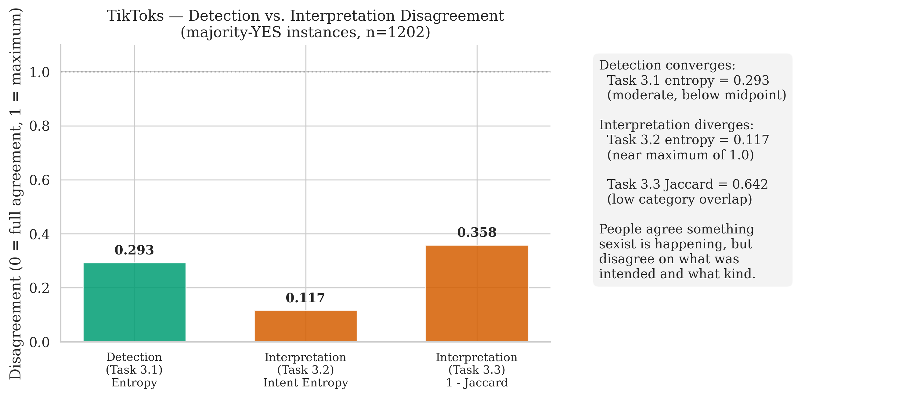

| Measure | Value |
|---------|-------|
| Detection entropy (Task 3.1) | 0.219 |
| Intent entropy (Task 3.2, majority-YES) | 0.118 |
| Category Jaccard (Task 3.3, majority-YES) | 0.642 |

The detection-interpretation gap is **attenuated** in videos. Both detection and interpretation show low disagreement. With only 2-3 annotators, there is mathematically less room for disagreement.

### 7.3 Gender Comparison (Videos)

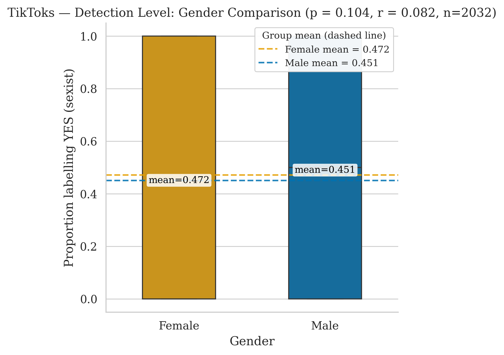

| Metric | Female | Male | Difference |
|--------|--------|------|-----------|
| Mean YES rate | 0.472 | 0.451 | +0.021 |
| n (both genders present) | 2,032 / 2,524 | | |

| Test | Statistic | Value |
|------|-----------|-------|
| Wilcoxon W | | 53,205.0 |
| p-value | | 0.104 (n.s.) |
| Rank-biserial r | | **0.082** |

No significant detection-level gender difference.

### 7.4 Gender Category Rates (Videos, Holm-Corrected)

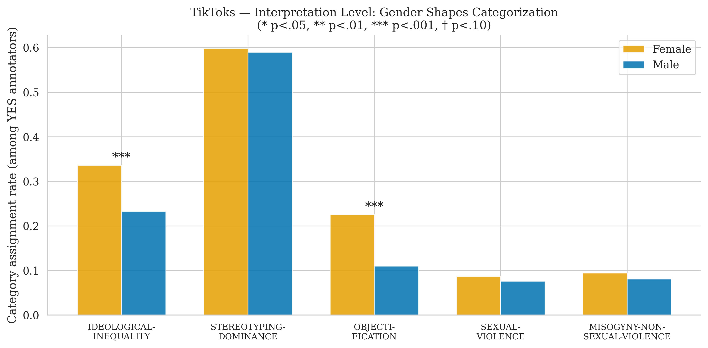

| Category | F rate | M rate | Diff | Cohen's h | OR | p (raw) | p (adjusted) | Sig |
|----------|--------|--------|------|-----------|-----|---------|-------------|-----|
| IDEOLOGICAL-INEQUALITY | 0.336 | 0.233 | +0.104 | **0.231** | 1.671 | 3.8 x 10^-9 | **1.5 x 10^-8** | *** |
| STEREOTYPING-DOMINANCE | 0.598 | 0.590 | +0.008 | 0.017 | 1.035 | 0.664 | 0.737 | n.s. |
| MISOGYNY-NON-SEXUAL-VIOLENCE | 0.094 | 0.081 | +0.014 | 0.048 | 1.185 | 0.246 | 0.737 | n.s. |
| SEXUAL-VIOLENCE | 0.087 | 0.076 | +0.010 | 0.038 | 1.148 | 0.359 | 0.737 | n.s. |
| OBJECTIFICATION | 0.225 | 0.110 | **+0.115** | **0.313** | 2.355 | 2.1 x 10^-15 | **1.0 x 10^-14** | *** |

Video category effects are the largest observed (h = 0.23 for ideological inequality, h = 0.31 for objectification). However, these must be interpreted cautiously: **only 10 annotators** contribute to the video dataset, so individual annotator preferences may dominate.

### 7.5 Videos: Disagreement by Language

| Language | n | Entropy Mean | Full Agreement % | Cond. Entropy 3.2 |
|----------|---|-------------|-----------------|-------------------|
| English | 1,000 | 0.221 | 75.9% | 0.167 |
| Spanish | 1,524 | 0.217 | 76.4% | 0.087 |

---

## 9. Cross-Modal Annotator Pool Analysis

This section checks whether differences between modalities could be confounded by different annotator populations.

### 8.1 Pool Overlap

| Metric | Value |
|--------|-------|
| Tweets annotators | 809 |
| Memes annotators | 887 |
| Shared (Tweets & Memes) | 809 (100% of tweets pool) |
| Memes-only | 78 |
| Tweets-only | 0 |
| **Jaccard similarity** | **0.912** |
| Videos annotators | 10 (all shared with tweets/memes) |

**All 809 tweet annotators also annotated memes.** The meme pool has 78 additional annotators. The pools are nearly identical.

### 8.2 Demographic Comparison (Full Pools)

| Attribute | Chi-squared | p-value | Cramer's V | Interpretation |
|-----------|------------|---------|------------|----------------|
| Gender | 0.04 | 0.846 | 0.005 | Identical |
| Age | 0.31 | 0.857 | 0.013 | Identical |
| Ethnicity | 34.98 | < 0.001 *** | 0.144 | Small difference |
| Education | 5.06 | 0.408 | 0.055 | No difference |
| Country | 107.86 | < 0.001 *** | 0.252 | Moderate difference |

Gender, age, and education distributions are statistically identical across pools. Ethnicity shows a small difference (V = 0.14), and country composition is moderately different (V = 0.25) -- the 78 memes-only annotators come from somewhat different countries.

### 8.3 Annotation Volume

| Metric | Tweets | Memes |
|--------|--------|-------|
| Mean instances per annotator | 59.0 | 27.4 |
| Median | 57 | 27 |
| Min | 11 | 9 |
| Max | 171 | 54 |

**Shared annotators' volume:**

| Modality | Mean | Median |
|----------|------|--------|
| Tweets | 59.0 | 57 |
| Memes | 27.5 | 27 |

Annotators label roughly twice as many tweets as memes, consistent with the larger tweet dataset.

### 8.4 Implications for Cross-Modal Comparisons

The high pool overlap (Jaccard = 0.91) and matched demographics (gender, age, education) mean that **observed differences between tweets and memes are unlikely to be driven by different annotator populations.** The differences in disagreement patterns (tweets: 67.1% disagreement vs memes: 76.3%) and in gender effects (tweets: n.s. vs memes: p < 10^-24 at detection) reflect genuine modality differences in how sexism is perceived.

The videos dataset (10 annotators, variable panel size) is not directly comparable.

---

## 10. Qualitative Examples

### 9.1 Type 1: Detection Agreement + Interpretation Divergence

These illustrate the paper's core finding: annotators agree *that* content is sexist but disagree on *intent* and *category*.

**Example 1** (ID: 202424, English, 6/6 YES):
> "this is the same little boy who has said 'when we get married, I'm going to slap the shit out of you- fucking stupid bitch'"

| Annotator | Gender | Intent | Categories |
|-----------|--------|--------|-----------|
| 0 | F | JUDGEMENTAL | MISOGYNY |
| 1 | F | REPORTED | STEREOTYPING, OBJECTIFICATION |
| 2 | M | JUDGEMENTAL | STEREOTYPING |
| 3 | M | DIRECT | STEREOTYPING, OBJECTIFICATION, SEXUAL-VIOLENCE |
| 4 | M | REPORTED | SEXUAL-VIOLENCE |
| 5 | F | DIRECT | MISOGYNY |

*Entropy 1.2 = 1.585, Jaccard 1.3 = 0.189* -- maximum intent disagreement and very low category overlap despite unanimous detection agreement.

**Example 2** (ID: 200626, English, 6/6 YES):
> "People shaming women for riding the cock carousel but idk that sounds like that might be a fun attraction at some gay carnival or smth"

| Annotator | Gender | Intent | Categories |
|-----------|--------|--------|-----------|
| 0 | F | UNKNOWN | OBJECTIFICATION, SEXUAL-VIOLENCE |
| 1 | F | REPORTED | STEREOTYPING |
| 2 | M | JUDGEMENTAL | OBJECTIFICATION, SEXUAL-VIOLENCE, MISOGYNY |
| 3 | M | JUDGEMENTAL | MISOGYNY |
| 4 | M | DIRECT | STEREOTYPING |
| 5 | F | REPORTED | IDEOLOGICAL-INEQUALITY, STEREOTYPING, OBJECTIFICATION |

*Entropy 1.2 = 1.918, Jaccard 1.3 = 0.208* -- 4 different intent labels assigned, all 5 sexism categories invoked.

### 9.2 Type 2: Gender-Differential Categorization

These show gender patterns in *what kind* of sexism is perceived.

**Example** (ID: 101502, Spanish, 5/6 YES):
> "@africajotes2014 ... Es que llevaba una falda muy corta, iba provocando..."
> *(Translation: "She was wearing a very short skirt, she was provoking...")*

| Annotator | Gender | Intent | Categories |
|-----------|--------|--------|-----------|
| 0 | F | DIRECT | OBJECTIFICATION, SEXUAL-VIOLENCE, MISOGYNY |
| 1 | F | DIRECT | SEXUAL-VIOLENCE |
| 2 | F | DIRECT | OBJECTIFICATION |
| 3 | M | DIRECT | OBJECTIFICATION |
| 4 | M | DIRECT | IDEOLOGICAL-INEQUALITY, STEREOTYPING |
| 5 | M | NO | - |

Female annotators emphasize **sexual violence and objectification**; male annotators see **ideological inequality and stereotyping** -- the same content, different frames.

---

## 11. Summary Table

| Measure | Value | Effect Size | Interpretation |
|---------|-------|------------|----------------|
| **Tweets: Instances with disagreement** | 67.1% | -- | Disagreement is the norm |
| **Tweets: Detection entropy** | mean 0.547 | -- | Moderate detection disagreement |
| **Tweets: Intent entropy (YES)** | mean 0.876 | -- | Near-maximum interpretation disagreement |
| **Tweets: Category Jaccard (YES)** | mean 0.382 | -- | Low category overlap |
| Tweets: Gender detection effect | p = 0.142 | r = -0.026 | No gender difference at detection |
| Tweets: Misogyny gender effect | p_adj = 0.005 | h = 0.045 | Negligible effect size |
| Tweets: Gender-aligned 3-3 splits | 10.1% | -- | Gender is not the main disagreement axis |
| Tweets: Gender effect on intent (Task 1.2) | min p_adj = 0.001 | max \|h\| = 0.048 | Holm-significant but **practically negligible** |
| Memes: Gender effect on intent (Task 2.2) | p_adj = 0.287 | \|h\| = 0.025 | No gender effect on intent attribution |
| **Memes: Instances with disagreement** | 76.3% | -- | Even more disagreement than tweets |
| **Memes: Gender detection effect** | p < 10^-24 | **r = 0.240** | Small effect; F label sexist more often |
| **Memes: Objectification gender effect** | p_adj < 10^-8 | **h = 0.102** | Small effect; F see more objectification |
| Videos: Gender detection effect | p = 0.104 | r = 0.082 | Not significant |
| Videos: Objectification gender effect | p_adj < 10^-14 | h = 0.313 | Moderate, but only 10 annotators |
| Videos: Ideological inequality gender effect | p_adj < 10^-8 | h = 0.231 | Moderate, but only 10 annotators |
| Cross-modal: Pool Jaccard (tweets-memes) | 0.912 | -- | Near-complete annotator overlap |
| Intent ambiguity -> disagreement | p < 0.001 | r = 0.064 | Negligible effect size |

---

## 12. Methodological Notes

### 11.1 Multiple Comparison Correction

All per-category gender tests (Fisher's exact, 5 categories per modality) are corrected using the **Holm-Bonferroni step-down procedure** within each modality. This is uniformly more powerful than Bonferroni while controlling the family-wise error rate.

Before correction, the following appeared significant at alpha = 0.05:
- Tweets: Misogyny (p = 0.001), Sexual-violence (p = 0.016), Objectification (p = 0.053)
- Memes: Objectification (p < 10^-9)

After Holm correction:
- **Tweets: Only misogyny survives** (p_adj = 0.005)
- **Memes: Only objectification survives** (p_adj < 10^-8)
- Sexual-violence in tweets (p_adj = 0.064) and objectification in tweets (p_adj = 0.159) no longer reach significance

### 11.2 Effect Sizes

| Measure | When Used | Interpretation Benchmarks |
|---------|-----------|--------------------------|
| Rank-biserial r | Wilcoxon signed-rank, Mann-Whitney U | < 0.1 negligible, 0.1-0.3 small, 0.3-0.5 medium, > 0.5 large |
| Cohen's h | Fisher's exact (proportion comparison) | 0.2 small, 0.5 medium, 0.8 large |
| Cramer's V | Chi-squared (demographic comparison) | 0.1 small, 0.3 medium, 0.5 large |

Key takeaway: **all tweet/meme gender effects are small or negligible in practical terms.** The memes detection-level difference (r = 0.24) and category-level objectification difference (h = 0.10) are the largest effects, but neither reaches the "medium" threshold. The extreme p-values reflect large sample sizes, not large effects.

### 11.3 Limitations

1. **Video dataset constraints:** Only 10 annotators with 2-3 per instance. Effect sizes appear larger but may reflect individual annotator preferences rather than population-level gender differences.

2. **Annotation design:** Tweets and memes always have exactly 3F + 3M annotators by design. This balanced design is a strength for gender comparisons but means we cannot disentangle gender from annotator-slot effects.

3. **Independence assumption:** Fisher's exact tests treat each annotation as independent, but the same annotators appear across multiple instances. This inflates significance for the category-level tests. Multilevel models would be more appropriate for a publication-quality analysis.

4. **Category non-exclusivity:** Annotators can assign multiple categories to a single instance, meaning the 5 Fisher tests within a modality are not fully independent (which Holm correction assumes). This is a conservative direction -- FDR correction would be more permissive.

### 11.4 Figures Index

| Figure | File |
|--------|------|
| Tweets: Agreement Distribution | `fig_agreement_distribution_tweets.png` |
| Tweets: Detection vs Interpretation | `fig_detection_vs_interpretation_tweets.png` |
| Tweets: Gender Detection | `fig_gender_detection_tweets.png` |
| Tweets: Gender Categorization | `fig_gender_categorization_tweets.png` |
| Tweets: Gender Intent | `fig_gender_intent_tweets.png` |
| Tweets + Memes: Gender Intent (side-by-side) | `fig_gender_intent_tweets_memes.png` |
| Memes: Agreement Distribution | `fig_agreement_distribution_memes.png` |
| Memes: Detection vs Interpretation | `fig_detection_vs_interpretation_memes.png` |
| Memes: Gender Detection | `fig_gender_detection_memes.png` |
| Memes: Gender Categorization | `fig_gender_categorization_memes.png` |
| Memes: Gender Intent | `fig_gender_intent_memes.png` |
| TikToks: Agreement Distribution | `fig_agreement_distribution_tiktoks.png` |
| TikToks: Detection vs Interpretation | `fig_detection_vs_interpretation_tiktoks.png` |
| TikToks: Gender Detection | `fig_gender_detection_tiktoks.png` |
| TikToks: Gender Categorization | `fig_gender_categorization_tiktoks.png` |
